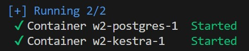
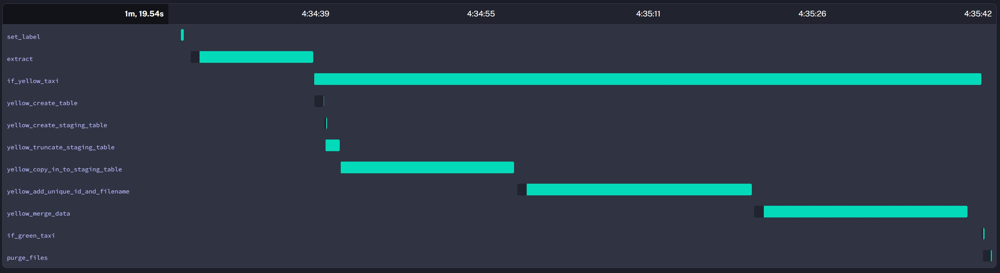
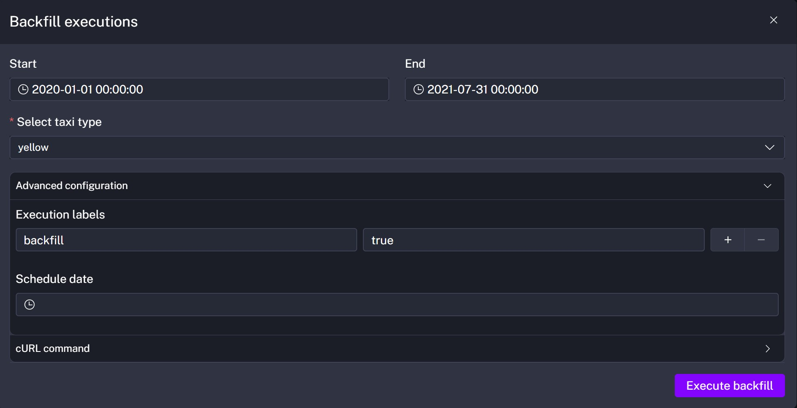

# Kestra Orchestration on GCP

## Project Overview
This project demonstrates how to use Kestra for orchestrating workflows to manage data. The first part focuses on integrating PostgreSQL and Kestra flows to extract, transform, and load (ETL) NYC Taxi data. The final part involves using a bucket (data lake) and BigQuery (data warehouse) on GCP with Kestra to process larger datasets and enable future cloud-based analysis.

## Kestra
Kestra is an open-source orchestration platform designed to simplify workflow automation and data pipeline management, with the objective of making complex processes more efficient and scalable.
### Running Kestra with Docker Compose
Kestra requires local storage and a PostgreSQL database to store its platform data. The docker-compose file launches the latest version of Kestra with additional properties and a PostgreSQL instance to ensure persistent data.
```bash
#In detached mode
docker-compose up -d
```


### PostgreSQL
The main purpose of this workflow is to extract CSV files from different years and months, transform the data, and load it into PostgreSQL. To prevent duplicate data, two additional columns are added—one of them is a unique identifier generated using MD5 based on the row's information. Each time the data ingestion task runs, it checks whether the data has already been ingested before inserting it into the main table. There are two main tables, one for green taxis and another for yellow taxis.


> **Note:** The PostgreSQL container where the data is stored is separate and isolated from the one created in the docker-compose file with Kestra.

Below is an overview of the sequence of tasks in the flow to accomplish data ingestion.

#### Scheduling Jobs
Data is delivered to the repository every month. It is possible to schedule an automatic data ingestion flow to run on the first day of each month. Additionally, since there is historical data from previous years that has not yet been ingested, "backfills" are used to automatically simulate specific time ranges and execute the ingestion flow for those periods.

Below is an example of how to set the time range for a backfill. The range is from 2020-01-01 to 2021-07-31 for green taxi:


### Google Cloud Platform (GCP)
When working with Google Cloud Platform (GCP), the key elements are the credentials and variables that Kestra requires to execute flows correctly. It is essential to create a Service Account and configure the credentials in the "gcp_kv file", along with the project ID and other required fields. Once set up, Kestra will securely store this information for use across all flows.

The "gcp_setup" flow automatically creates a Bucket (for storing CSV files) and a Dataset in BigQuery (to serve as a data warehouse for tables during the loading process). This ensures a seamless and organized workflow for data ingestion and storage.

#### Scheduling Jobs
The idea is the same as when using a locally running PostgreSQL container. However, in this case, it is possible to ingest larger datasets using backfills because we can leverage the power of the cloud. The NYC Yellow Taxi Data, for instance, is a very large and resource-intensive dataset. With Google Cloud Platform (GCP), accomplishing this task becomes significantly easier and more efficient.

Below is the configuration of a backfill in the range from 2020-01-01 to 2021-07-31 for yellow taxi


## Conclusion
Kestra provides a powerful and flexible orchestration platform for managing data workflows efficiently. By integrating with PostgreSQL, it ensures structured ETL processes that prevent duplicate data ingestion. The use of scheduling and backfills allows for seamless automation of historical and ongoing data processing. Additionally, leveraging Google Cloud Platform (GCP) enables scalable data handling, making it easier to manage large datasets using cloud storage and BigQuery.